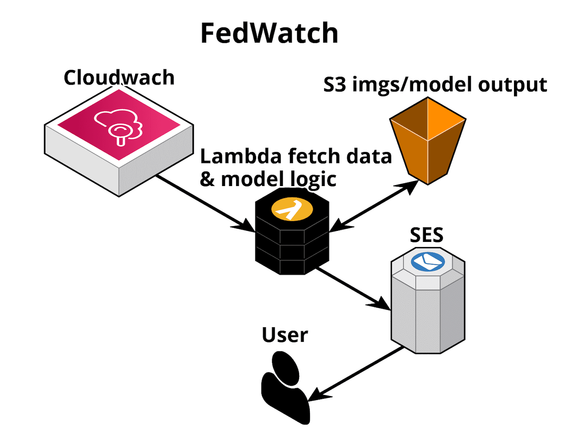
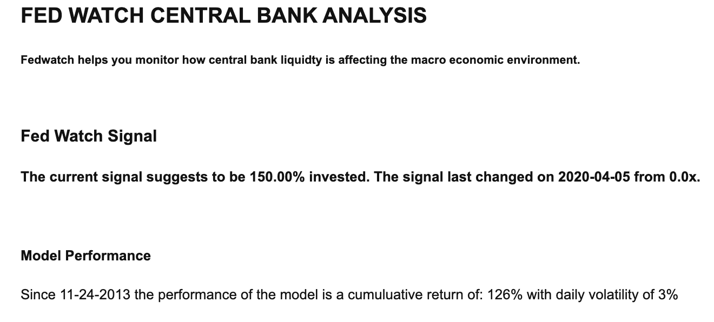
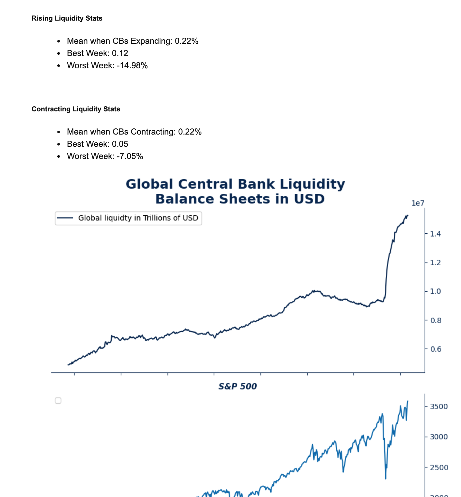

# Fed Watch

This is part of the capstone project for the Northwestern University MSDS Program. 
Group Members: Terrence Connelly, Samuel Mori, Ryan Bacastow

# Data Sources 
https://fred.stlouisfed.org/series/WALCL

# Architecture

- Cloudwatch triggers lambda handler
- Lambda pulls data and makes calculations
- Lambda writes img output to s3
- Lambda invokes SES message to user emails

# Future Potential Architecture

# Example

