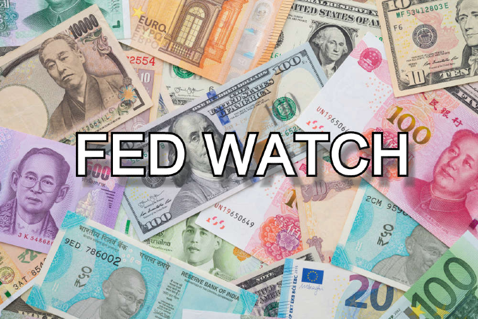
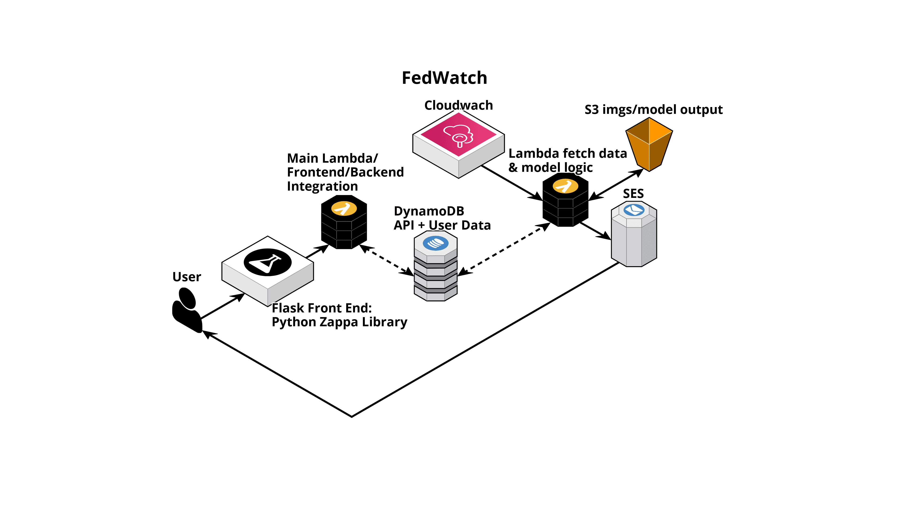

# Fed Watch

This is part of the capstone project for the Northwestern University MSDS Program. 
Group Members: Terrence Connelly, Samuel Mori, Ryan Bacastow

# Data Sources 
https://fred.stlouisfed.org/series/WALCL

# Architecture

- Cloudwatch triggers lambda handler
- Lambda pulls data and makes calculations
- Lambda writes img output to s3
- Lambda invokes SES message to user emails

# Future Potential Architecture

# The Model
Changes in central bank liquidity in US $ terms have been very important for asset price performance for many years.   
This model uses US Federal Reserve, European Central Bank, foreign exchange rates and the S&P 500 stock market index to tell users when they should be fully invested, out of the stock market or even over-weight the stock market.  

The model is theoretical only and not investment advice .

# Example

